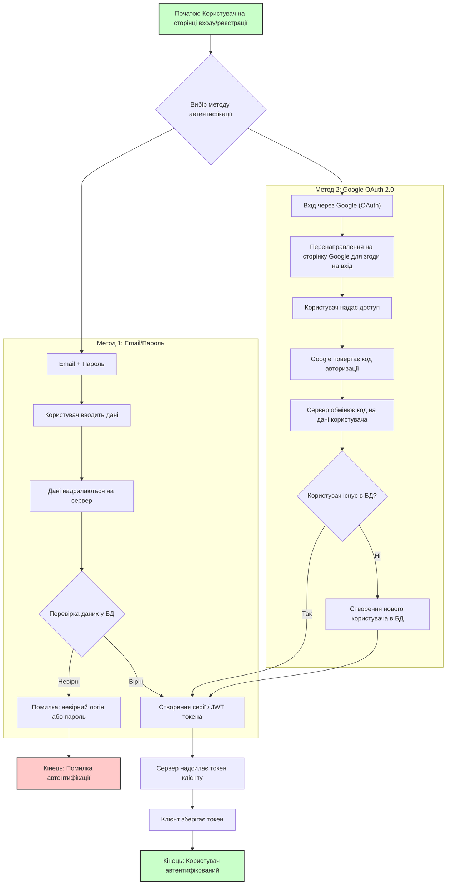

```mermaid
graph TD
A[Початок: Користувач на сторінці входу/реєстрації] --> B{Вибір методу автентифікації};

    B --> C[Email + Пароль];
    B --> D["Вхід через Google (OAuth)"];

    subgraph "Метод 1: Email/Пароль"
        C --> E[Користувач вводить дані];
        E --> F[Дані надсилаються на сервер];
        F --> G{Перевірка даних у БД};
        G -- Невірні --> H[Помилка: невірний логін або пароль];
        G -- Вірні --> I[Створення сесії / JWT токена];
    end

    subgraph "Метод 2: Google OAuth 2.0"
        D --> J[Перенаправлення на сторінку Google для згоди на вхід];
        J --> K[Користувач надає доступ];
        K --> L[Google повертає код авторизації];
        L --> M[Сервер обмінює код на дані користувача];
        M --> N{Користувач існує в БД?};
        N -- Так --> I;
        N -- Ні --> O[Створення нового користувача в БД];
        O --> I;
    end

    I --> P[Сервер надсилає токен клієнту];
    P --> Q[Клієнт зберігає токен];
    Q --> R[Кінець: Користувач автентифікований];

    H --> S[Кінець: Помилка автентифікації];

    style A fill:#c9ffc9,stroke:#333,stroke-width:2px
    style R fill:#c9ffc9,stroke:#333,stroke-width:2px
    style S fill:#ffc9c9,stroke:#333,stroke-width:2px
```
